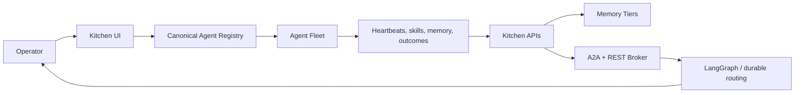
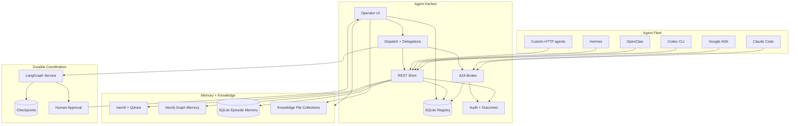
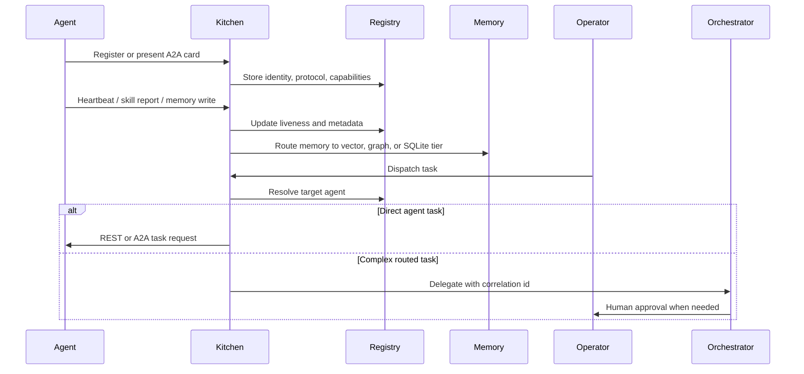
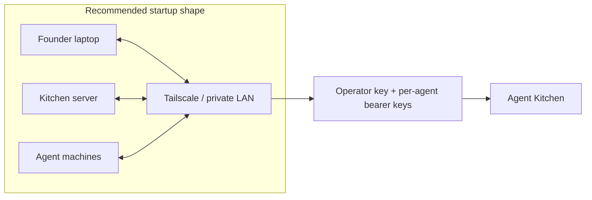
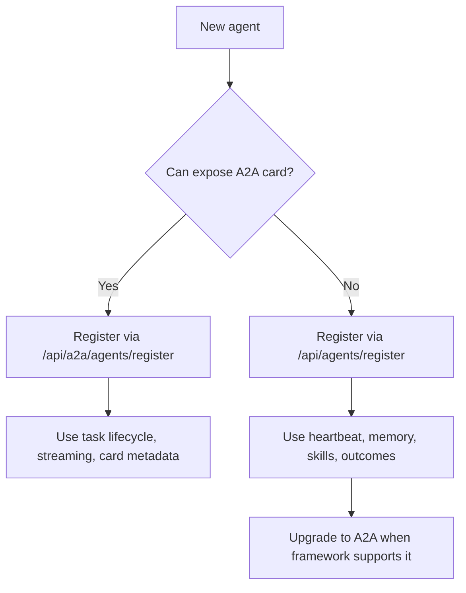
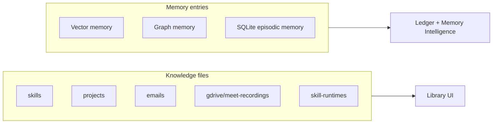

# Agent Kitchen

> A local-first control plane for startups running many agents across many machines.

Agent Kitchen is an open-source operations hub for multi-agent systems. It gives a team one durable place to register agents, expose A2A-compatible task endpoints, track liveness, route memory writes, inspect knowledge and memory health, and hand complex work to orchestration when coordination needs to survive beyond a single prompt.

Kitchen is built for the messy middle between experiments and production: Claude Code on one machine, OpenClaw or Hermes on another, Google ADK services on a private network, a LangGraph router on a server, and a founder who needs to see what is alive, what is stuck, and what can safely receive work.

<p align="center">
  <a href="#quickstart">Quickstart</a> |
  <a href="#architecture">Architecture</a> |
  <a href="#agent-registry">Agent Registry</a> |
  <a href="#security-model">Security</a> |
  <a href="#docs">Docs</a>
</p>

---

## Why Kitchen Exists

Most agent stacks are excellent at creating one agent. Startups quickly run into a different problem: operating a small society of agents.

Kitchen focuses on the operating layer:

- Which agents exist?
- Which machine are they on?
- Which protocol do they speak?
- Are they alive?
- What can they do?
- Which memory system should receive their reports?
- Which tasks need a broker, a human approval gate, or durable orchestration?

Kitchen does not try to replace your agent framework. It gives your frameworks a shared registry, transport surface, memory boundary, and operator dashboard.



## What Kitchen Does

- **Canonical agent registry:** SQLite-backed roster for local, REST, UI, and A2A agents.
- **A2A broker:** Agent card discovery, JSON-RPC endpoints, task lifecycle routes, SSE task updates, and outbound A2A delegation.
- **REST shim:** Framework-agnostic endpoints for agents that do not speak A2A yet.
- **Dispatch:** Send work to registered agents and inspect live delegation history.
- **Flow map:** Visual system topology for agents, memory, skills, dispatch, and infrastructure.
- **Knowledge Library:** Live file counts for configured knowledge collections such as skills, projects, recordings, emails, and docs.
- **Memory routing:** Vector memory through mem0/Qdrant, graph memory through Neo4j, and episodic/audit memory in Kitchen SQLite.
- **APO review:** Review and approve self-learning skill improvement proposals.
- **Operator security:** Operator-gated registry writes plus per-agent bearer keys for write/reporting endpoints.

## Architecture

Kitchen is intentionally thin at the boundary and durable at the center.



### Data Flow



## Quickstart

### Prerequisites

- Node.js and npm
- Python 3
- Docker with Docker Compose
- Optional: Qdrant Cloud URL and API key for vector memory
- Optional: Tailscale for multi-machine private networking

```bash
git clone https://github.com/lac5q/agent-kitchen.git
cd agent-kitchen
npm install
./setup.sh --wizard
./setup.sh
```

Open Kitchen:

```text
http://localhost:3000
```

For a local production-style server:

```bash
npm --prefix apps/kitchen run build
KITCHEN_PUBLIC_BASE_URL=http://localhost:3002 \
KITCHEN_A2A_ENDPOINT_BASE_URL=http://localhost:3002 \
npm --prefix apps/kitchen run start -- --port 3002
```

## Recommended Deployment

Kitchen is designed to start private and become public only when you mean it.



Operating profiles:

- `local-dev`: one developer machine; loopback registry writes can work without an operator key.
- `single-host`: all services on one server or VM; operator key required.
- `private-network`: recommended startup deployment for multiple machines on Tailscale or LAN.
- `cloud-https`: internet-reachable deployment behind HTTPS reverse proxy or tunnel.
- `custom`: operator-defined topology with explicit environment values.

See [Install profiles](docs/install-profiles.md).

## Agent Registry

Kitchen has one canonical registry. The `/agents` page shows this DB-backed roster, not ad hoc files.

There are two common ways to register agents.

### Register a REST agent

```bash
curl -X POST http://localhost:3000/api/agents/register \
  -H 'Content-Type: application/json' \
  -H 'x-kitchen-operator-key: <operator-key>' \
  -d '{
    "id": "worker-1",
    "name": "Worker 1",
    "role": "Research and implementation agent",
    "platform": "codex",
    "protocol": "rest",
    "location": "tailscale",
    "host": "100.64.0.10",
    "port": 8787,
    "healthEndpoint": "/health"
  }'
```

### Register an A2A agent by card URL

```bash
curl -X POST http://localhost:3000/api/a2a/agents/register \
  -H 'Content-Type: application/json' \
  -H 'x-kitchen-operator-key: <operator-key>' \
  -d '{
    "cardUrl": "http://agent.tailnet:8000/.well-known/agent-card.json",
    "source": "a2a"
  }'
```

The response may include an API key unless `issueApiKey` is false. Store it securely. Kitchen never displays stored bearer tokens after creation.

### Legacy remote agents

Older `agents.config.json` entries are legacy remote polling config. They are useful as migration input, but they are not the canonical registry until you register them through the API or ingest an A2A card.

If `/agents` shows fewer agents than expected, check:

- The agent has been registered into the canonical registry.
- Its host and port are real, not placeholders such as `100.x.x.x`.
- A2A agents expose a valid card URL.
- REST agents have a health endpoint if you want remote reachability.

## Protocol Strategy



Use **A2A** when the framework can expose or consume an agent card and task lifecycle. This is the preferred path for standards-compatible agents such as Google ADK services and future A2A-native runtimes.

Use **REST shim** when the framework does not speak A2A yet or when you only need reporting: heartbeat, memory writes, skill outcomes, and registry visibility.

## Memory and Knowledge

Kitchen keeps knowledge files and conversation memory separate on purpose.



The Library counts `.md`, `.mdx`, and `.txt` files from configured collections. Memory entries live in separate memory services and SQLite tables, so a collection file count is not the same thing as total memories.

## Security Model

Kitchen is built for private-network production first.

- Registry writes require `KITCHEN_OPERATOR_API_KEY` outside local loopback.
- Agent write/reporting endpoints require per-agent bearer credentials minted by the registry.
- Memory read endpoints require operator authorization because they can expose sensitive context.
- Prefer Tailscale or a private LAN for multi-machine startup deployments.
- Use HTTPS and explicit operator keys for public or tunnel exposure.
- Treat agent cards as untrusted input. Kitchen validates URL policy, payload size, required fields, and registration authorization.

## Local URLs

- Dashboard: `http://localhost:3000`
- Production-style local server: `http://localhost:3002`
- Registry UI: `/agents`
- Dispatch UI: `/dispatch`
- Flow UI: `/flow`
- Library UI: `/library`
- A2A card: `/.well-known/agent-card.json`

## Development

```bash
npm run dev
npm run test
npm run lint
npm run build
npm run profiles:check
npm run first-run:check
```

## Project Structure

```text
agent-kitchen/
├── apps/kitchen/              # Next.js UI and API routes
├── services/orchestration/    # Python LangGraph orchestration service
├── services/memory/           # mem0 service wrapper
├── services/knowledge-mcp/    # Knowledge/tool-attention MCP facade
├── services/voice-server/     # Optional voice service
├── config/                    # Operating profiles
├── docker/                    # Service Dockerfiles
├── docs/                      # User and architecture docs
├── scripts/                   # Setup and validation scripts
└── data/                      # Local SQLite state, gitignored
```

## Docs

- [Architecture](docs/architecture.md)
- [Install profiles](docs/install-profiles.md)
- [REST API reference](docs/rest-api.md)
- [Memory architecture](docs/memory-architecture.md)
- [Claude Code integration](docs/integrations/claude-code.md)
- [Google ADK integration](docs/integrations/google-adk.md)
- [LangGraph integration](docs/integrations/langgraph.md)
- [CrewAI and AutoGen integration](docs/integrations/crewai-autogen.md)

## Status

Agent Kitchen is actively evolving. The current focus is making the registry, A2A transport, memory routing, and operator UI sturdy enough for a real multi-agent startup deployment while keeping the system hackable for local workflows.

## License

License and OSS governance are finalized in Phase 41.
