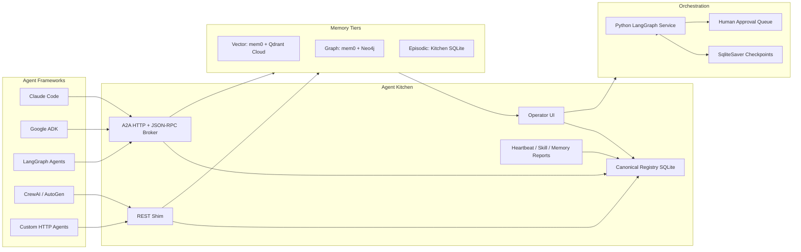

# Agent Kitchen

Agent Kitchen is an open-source operations hub for multi-agent systems. It gives a startup team one place to register agents, expose A2A-compatible task endpoints, track heartbeats, route memory writes, inspect memory health, and hand work to a LangGraph orchestration service when a task needs durable coordination.

The default deployment model is intentionally practical: run Kitchen on a trusted private network such as Tailscale, register each agent into the canonical registry, and let agents communicate over authenticated HTTP/A2A. HTTPS public deployment is supported, but private-network deployment is the recommended first production shape.

## What Kitchen Does

- **Canonical agent registry:** DB-backed roster for local, REST, UI, and A2A agents.
- **A2A hub:** Agent card discovery, JSON-RPC endpoint, task lifecycle routes, SSE task updates, and outbound A2A delegation.
- **REST shim:** Framework-agnostic endpoints for agents that do not speak A2A yet.
- **Memory routing:** Vector memory through mem0/Qdrant Cloud, graph memory through mem0/Neo4j, and episodic/audit memory in Kitchen SQLite.
- **Orchestration boundary:** Kitchen delegates complex routed work to a Python LangGraph service with checkpointing and human-in-the-loop approval.
- **Operator UI:** Registry, Flow, memory intelligence, dispatch, ledger, library, skills, and APO observability views.

## Five-Minute Quickstart

Prerequisites:

- Node.js and npm
- Python 3
- Docker with Docker Compose
- Qdrant Cloud URL and API key for vector memory

```bash
git clone https://github.com/lac5q/agent-kitchen.git
cd agent-kitchen
npm install
./setup.sh --wizard
./setup.sh
```

Open Kitchen:

```text
http://localhost:3000
```

For a local production-style server without Docker orchestration:

```bash
npm --prefix apps/kitchen run build
KITCHEN_PUBLIC_BASE_URL=http://localhost:3002 \
KITCHEN_A2A_ENDPOINT_BASE_URL=http://localhost:3002 \
npm --prefix apps/kitchen run start -- --port 3002
```

## Register Your First Agent

Kitchen has two agent concepts:

- **Canonical registry agents:** Agents stored in SQLite by `/api/agents/register` or `/api/a2a/agents/register`. The `/agents` page shows this canonical registry.
- **Legacy remote agents:** Older entries in `agents.config.json` that are polled by `/api/remote-agents`. These are not automatically canonical agents.

If `/agents` only shows one agent, check whether the others are still only in `agents.config.json`, whether their host values are placeholders, or whether they have not been registered into the canonical registry.

Register a REST-shim agent:

```bash
curl -X POST http://localhost:3000/api/agents/register \
  -H 'Content-Type: application/json' \
  -H 'x-kitchen-operator-key: <operator-key>' \
  -d '{
    "id": "worker-1",
    "name": "Worker 1",
    "role": "Research and implementation agent",
    "platform": "codex",
    "protocol": "rest",
    "location": "tailscale",
    "host": "100.64.0.10",
    "port": 8787,
    "healthEndpoint": "/health"
  }'
```

The response includes an API key when `issueApiKey` is not false. Store it securely; agents use it as `Authorization: Bearer <api-key>` for write/reporting endpoints.

Register an A2A agent by card URL:

```bash
curl -X POST http://localhost:3000/api/a2a/agents/register \
  -H 'Content-Type: application/json' \
  -H 'x-kitchen-operator-key: <operator-key>' \
  -d '{
    "cardUrl": "http://agent.tailnet:8000/.well-known/agent-card.json",
    "source": "a2a"
  }'
```

## Architecture



Detailed docs:

- [Architecture](docs/architecture.md)
- [Install profiles](docs/install-profiles.md)
- [REST API reference](docs/rest-api.md)
- [Memory architecture](docs/memory-architecture.md)
- [Claude Code integration](docs/integrations/claude-code.md)
- [Google ADK integration](docs/integrations/google-adk.md)
- [LangGraph integration](docs/integrations/langgraph.md)
- [CrewAI and AutoGen integration](docs/integrations/crewai-autogen.md)

## A2A Versus REST Shim

Use **A2A** when the agent framework can expose or consume an agent card and task lifecycle. This is the preferred path for Claude Code-style agents, Google ADK agents, LangGraph agents, and future standards-compatible systems.

Use **REST shim** when the framework does not yet speak A2A or when you only need reporting: heartbeat, memory writes, skill outcomes, and registry visibility.

## Operating Profiles

Kitchen supports these profiles:

- `local-dev`: one developer machine; loopback registry writes can work without an operator key.
- `single-host`: all services on one server or VM; operator key required.
- `private-network`: recommended startup deployment for multiple machines on Tailscale or LAN.
- `cloud-https`: internet-reachable deployment behind HTTPS reverse proxy or tunnel.
- `custom`: operator-defined topology with explicit environment values.

See [Install profiles](docs/install-profiles.md).

## Security Model

- Registry writes require `KITCHEN_OPERATOR_API_KEY` outside local loopback.
- Agent write/reporting endpoints require per-agent bearer credentials minted by the registry.
- Memory read endpoints require operator authorization because they can expose sensitive context.
- Prefer Tailscale/private networks for startup deployments; use HTTPS and explicit operator keys for cloud exposure.
- Treat agent cards as untrusted input; Kitchen validates card URL policy, payload size, required fields, and registration authorization.

## Development

```bash
npm run dev
npm run test
npm run lint
npm run build
npm run profiles:check
npm run first-run:check
```

Useful local URLs:

- Dashboard: `http://localhost:3000`
- Production local server: `http://localhost:3002`
- A2A card: `/.well-known/agent-card.json`
- Registry UI: `/agents`
- Flow UI: `/flow`

## Project Structure

```text
agent-kitchen/
├── apps/kitchen/              # Next.js UI and API routes
├── services/orchestration/    # Python LangGraph orchestration service
├── services/memory/           # mem0 service wrapper
├── services/knowledge-mcp/    # Knowledge/tool-attention MCP facade
├── services/voice-server/     # Optional voice service
├── config/                    # Operating profiles
├── docker/                    # Service Dockerfiles
├── docs/                      # User and architecture docs
├── scripts/                   # Setup and validation scripts
└── data/                      # Local SQLite state, gitignored
```

## License

License and OSS governance are finalized in Phase 41.
