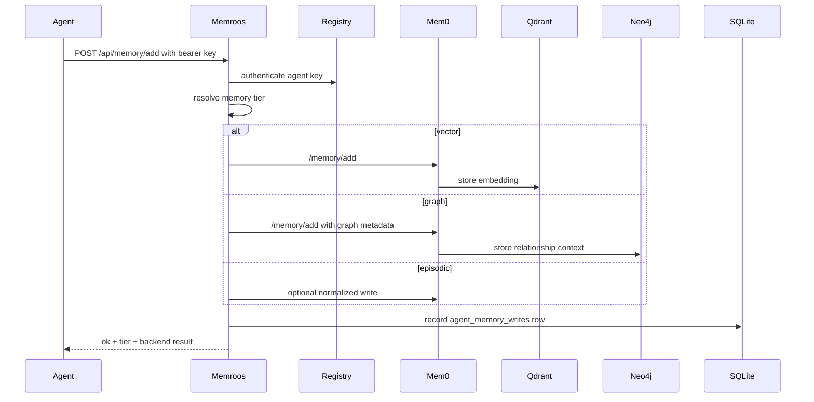

# Memory Architecture

MemroOS uses three memory tiers so agents can store the right kind of knowledge in the right backend.

## Tiers

| Tier | Backend | Best for | Route |
| --- | --- | --- | --- |
| Vector | mem0 + Qdrant Cloud | Semantic recall, similar situations, fuzzy knowledge | `/api/memory/add`, `/api/memory/search` |
| Graph | mem0 + Neo4j | People, agents, entities, relationships, dependencies | `/api/memory/add`, `/api/memory/graph` |
| Episodic | Memroos SQLite | Operational events, reports, audit-like memory writes | `/api/memory/add`, `/api/memory/health` |

## Write Path



## Routing Rules

Agents may specify a tier directly:

```json
{
  "content": "Worker 1 learned that private-network is the preferred startup deployment.",
  "tier": "vector",
  "metadata": { "topic": "deployment" }
}
```

Use:

- `vector` for facts that should be recalled by meaning.
- `graph` for relationships between people, agents, repos, tasks, services, or dependencies.
- `episodic` for event-like records where timestamp and provenance matter most.

If no tier is supplied, Memroos normalizes metadata and chooses the safest default for the current payload.

## Progressive Capability Boundaries

Tool-attention and memory are related, but they are not the same store.

- Progressive capability catalog entries describe which tools and systems are available, such as `mcp-server:gitnexus` or `capability:agent-lightning`.
- Tool-attention outcomes record whether a capability helped or failed for a task type.
- Memory stores compact durable lessons and preferences derived from use.

Do not store generated GitNexus code graphs, full impact reports, APO proposal bodies, approved skill patches, or raw tool outputs in memory. Those belong in their source systems: GitNexus indexes, APO proposal folders, audit logs, or source control.

Good memory examples:

- "GitNexus helped with impact analysis for memroos refactors."
- "Agent Lightning approval workflow is preferred for recurring skill fixes."

Bad memory examples:

- Full GitNexus symbol graphs or process traces.
- Full APO proposal markdown.
- Full skill patch contents.

## Read Path

- `/api/memory/search` reads vector memory.
- `/api/memory/graph` reads graph memory.
- `/api/memory/health` checks vector, graph, and episodic health.

All memory read endpoints require operator authorization because memory can contain sensitive strategy, credentials-adjacent operational context, or personal data.

## Neo4j Schema Guidance

Memroos does not force one global ontology yet. Use a small, stable vocabulary:

- `(:Agent {id, name, platform})`
- `(:Person {name})`
- `(:Project {name})`
- `(:Task {id, summary})`
- `(:Capability {id, name})`
- `(:Service {name, url})`

Suggested relationships:

- `(Agent)-[:HAS_CAPABILITY]->(Capability)`
- `(Agent)-[:WORKED_ON]->(Task)`
- `(Task)-[:PART_OF]->(Project)`
- `(Agent)-[:REPORTS_TO]->(Agent)`
- `(Service)-[:DEPENDS_ON]->(Service)`
- `(Person)-[:OWNS]->(Project)`

Prefer stable IDs in metadata so graph writes can be deduplicated later.

## Operational Checks

```bash
curl -H 'x-memroos-operator-key: <operator-key>' \
  'http://localhost:3000/api/memory/health'
```

Healthy deployments should show:

- Vector tier up when mem0 and Qdrant Cloud are reachable.
- Graph tier up when Neo4j is reachable.
- Episodic tier up when Memroos SQLite is writable.

## Recall Quality Evals

Tier health only proves that backends respond. Recall evals prove that agents can retrieve the right memories at the right time.

The canonical eval suite lives in `evals/memory-recall/cases.json`. Each case declares the scenario, target agent, task prompt, seed fixtures, expected facts or memory IDs, expected tiers, required recall timing, and scoring thresholds.

Run the suite through Memroos:

```bash
npm --prefix apps/memroos run eval:memory
npm --prefix apps/memroos run eval:memory -- --canary
npm --prefix apps/memroos run eval:memory -- --full
```

The API surface is:

- `GET /api/memory/evals/latest` for the latest persisted run.
- `POST /api/memory/evals/run?mode=canary|gold|full` for an on-demand run.

Results are stored in Memroos SQLite tables created lazily by the eval subsystem:

- `memory_eval_runs`
- `memory_eval_cases`
- `memory_eval_results`

Core metrics:

- `recallAtK`: expected memories or facts found in the top K.
- `precisionAtK`: relevant results divided by returned top-K results.
- `mrr`: reciprocal rank of the first relevant result.
- `tierCoverage`: required memory tiers represented in results.
- `falsePositiveRate`: non-relevant top-K results divided by returned top-K results.
- `latencyMs`: slowest observed retrieval latency in the case.

Default thresholds are `recall@5 >= 0.85`, `precision@5 >= 0.70`, `MRR >= 0.75`, and latency under 5s. Canary cases should run hourly, gold cases nightly, and the full suite before major routing or memory backend changes.

## Self-Learning Memory Loop

MemroOS should treat recall quality as the objective function for memory learning. The v1 loop is inspired by Karpathy's `autoresearch` pattern, but it does not fine-tune model weights:

1. Run memory recall evals.
2. Convert failures into deterministic reflections.
3. Generate typed memory self-edit proposals.
4. Require operator approval before applying any proposal.
5. Apply approved changes through typed handlers.
6. Rerun the relevant eval suite.
7. Keep the change only if recall metrics improve or remain above threshold; otherwise roll back.

The autoresearch-style extension is a memory policy lab:

- fixed harness: eval cases, fixtures, scoring, rollback, and experiment ledger
- one mutable candidate file: query expansion, tier fallback, reranking, and salience policy hooks
- objective: a scalar score derived from `recallAtK`, `mrr`, `precisionAtK`, `tierCoverage`, false-positive rate, and latency
- audit: every accepted, rejected, errored, or rolled-back experiment is persisted

AR model training is deferred. The first implementation should collect clean eval/proposal/experiment trajectories so a later lightweight autoregressive predictor can learn from audited memory outcomes instead of raw, unreviewed agent traces.

## Privacy Notes

- Do not write raw secrets to any memory tier.
- Use metadata to store provenance and classification.
- Treat graph memory as sensitive because relationship data can reveal strategy or personal context.
- Prefer operator-authenticated reads only; do not expose memory read routes publicly.
